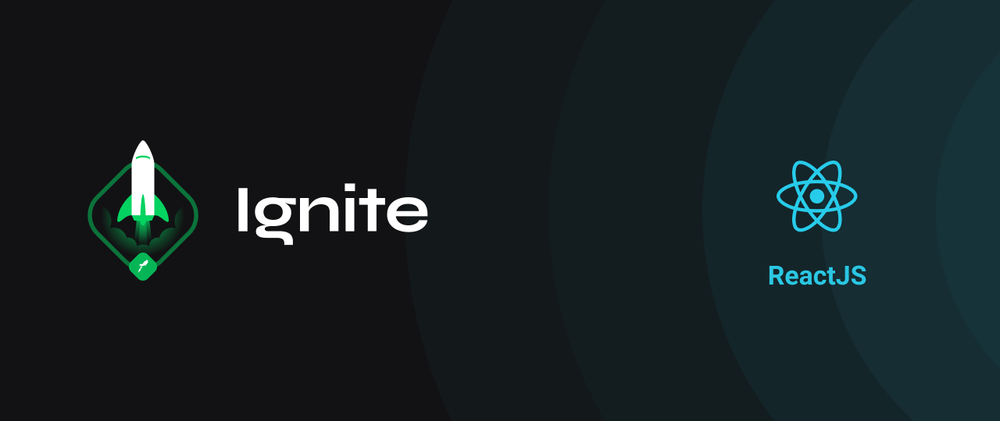

<h1 align="center">
    
</h1>

<h2 align="center">Criando um projeto do zero e Adicionando features ao blog</h2>

 

  <a href="#-tecnologias">Tecnologias</a>&nbsp;&nbsp;&nbsp;|&nbsp;&nbsp;&nbsp;
  <a href="#-projeto">Sobre o desafio</a>&nbsp;&nbsp;&nbsp;|&nbsp;&nbsp;&nbsp;
  <a href="#-tecnologias">Rodando a aplicação</a>&nbsp;&nbsp;&nbsp;

## 📦 Tecnologias

- Next.Js
- Sass
- Prismic

## 📦 Sobre o desafio

A primeira parte do desafio será uma aplicação onde o seu principal objetivo é criar um blog do zero. Você vai receber uma aplicação praticamente em branco que deve consumir os dados do Prismic e ter a interface implementada conforme o layout do Figma. Você terá acesso a diversos arquivos para implementar:

- Estilizações global, comun e individuais;
- Importação de fontes Google;
- Paginação de posts;
- Cálculo de tempo estimado de leitura do post;
- Geração de páginas estáticas com os métodos `getStaticProps` e `getStaticPaths`;
- Formatação de datas com `date-fns`;
- Uso de ícones com `react-icons`;
- Requisições HTTP com `fetch`;
- Entre outros.

A segunda parte do desafio: 

- Comentários com Utteranc;
- Preview do documento Prismic;
- Navegação entre post anterior e próximo;
- Informação de edição do post.

## 📦 Rodando a aplicação

- Clone o repositório
- Instale as dependências com yarn install
- Configurar as variáveis dentro de um arquivo `.env.local` seguindo o exemplo do arquivo `.env.example`